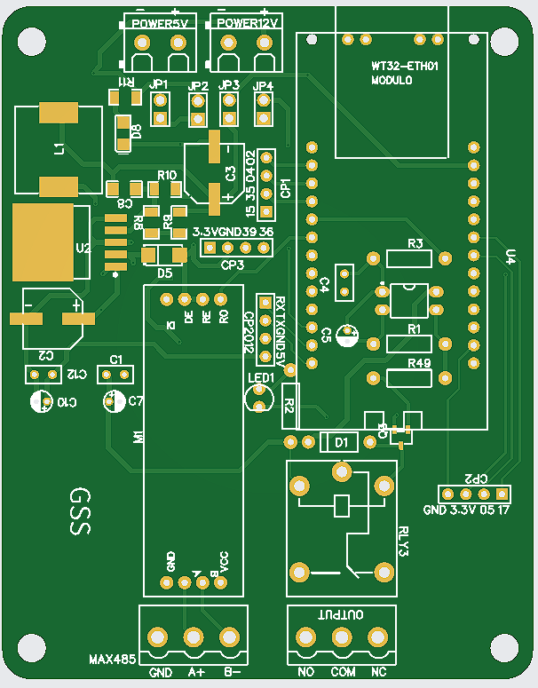

# Demostración de Lógica

Este repositorio contiene una demostración de la lógica utilizada para validar un código QR y controlar un relé en un sistema basado en MicroPython. Está diseñado como un ejemplo genérico para ilustrar el flujo de trabajo.

## Descripción
El sistema realiza las siguientes acciones:
- Recibe un código QR como entrada.
- Envía una solicitud HTTP a una API para validar el código.
- Si la validación es exitosa (código de respuesta 200), activa un relé durante 1 segundo y luego lo desactiva.

